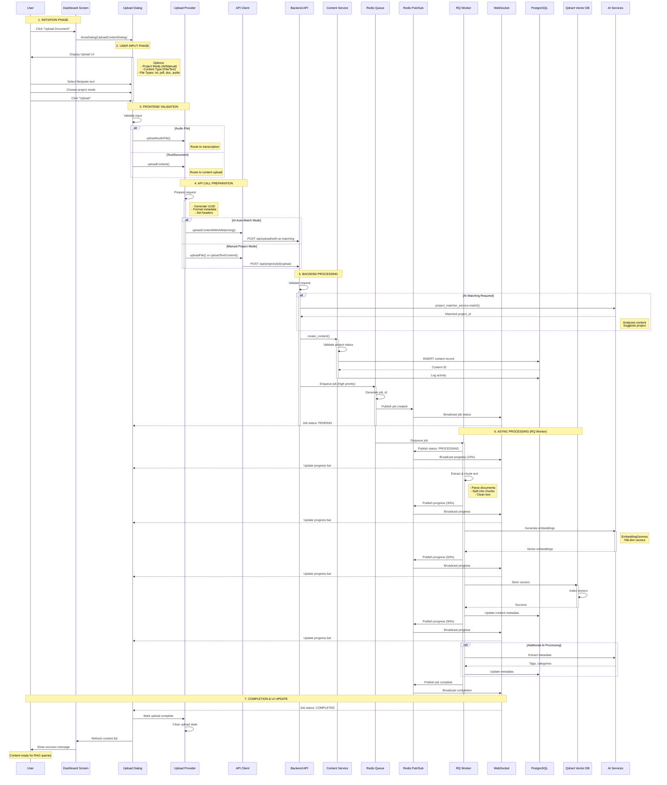
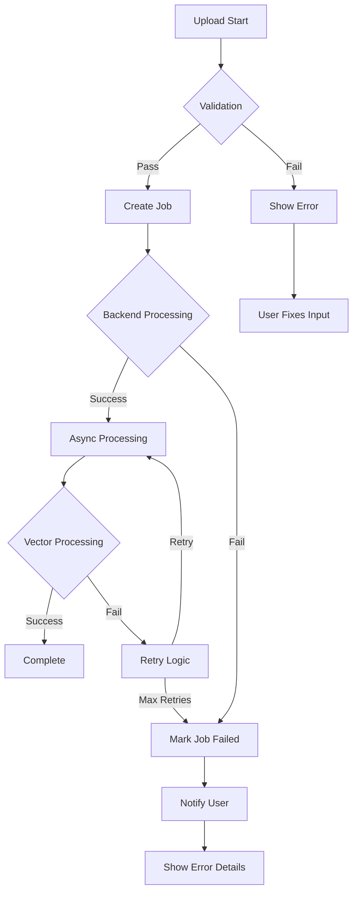

# PM Master V2 - Content Upload Flow Diagram

## End-to-End Upload Process Flow

## Component Responsibilities

### Frontend Components

| Component | File | Responsibilities |
|-----------|------|-----------------|
| **Dashboard Screen** | `dashboard_screen_v2.dart` | - Display upload buttons - Open upload dialog - Show content list |
| **Upload Dialog** | `upload_content_dialog.dart` | - User input collection - File validation - Progress display - Error handling |
| **Upload Provider** | `upload_provider.dart` | - State management - API orchestration - Progress tracking - Error recovery |
| **API Client** | `api_client.dart` | - HTTP requests - Auth headers - Response parsing |

### Backend Components

| Component | File | Responsibilities |
|-----------|------|-----------------|
| **Upload Router** | `upload.py` | - Request validation - AI matching coordination - Response formatting |
| **Content Router** | `content.py` | - Project-specific uploads - File validation - Job enqueuing |
| **Content Service** | `content_service.py` | - Business logic - Database operations - Activity logging |
| **Redis Queue** | `queue_config.py` | - Multi-priority queues (high, default, low) - Job enqueuing and management - Worker coordination |
| **Redis Pub/Sub** | `redis_cache_service.py` | - Real-time job status broadcasts - WebSocket integration - Multi-instance communication |
| **RQ Worker Tasks** | `content_tasks.py` `transcription_tasks.py` `integration_tasks.py` `summary_tasks.py` | - Async job processing - Text chunking and embedding - Vector storage - Progress updates |

## Data Flow Summary

### Upload Types
1. **Text Upload**: Direct text → Content Service → Redis Queue → RQ Worker → Vector DB
2. **File Upload**: File → Parse → Content Service → Redis Queue → RQ Worker → Vector DB
3. **Audio Upload**: Audio → Redis Queue → Transcription (Whisper/Salad/Replicate) → RQ Worker → Vector DB

### Processing Stages
1. **Validation** (Sync): File type, size, format checks
2. **Storage** (Sync): Database record creation
3. **Job Enqueuing** (Sync): Redis Queue job creation with priority
4. **Processing** (Async): RQ Worker processes chunking, embedding, indexing
5. **Notification** (Real-time): Redis Pub/Sub → WebSocket progress updates

### AI Integration Points
- **Project Matching**: Analyzes content to suggest/create projects
- **Content Classification**: Determines content type (meeting/email)
- **Metadata Extraction**: Extracts tags, topics, entities
- **Embedding Generation**: EmbeddingGemma creates 768-dim semantic vectors
- **Transcription**: Replicate (242x faster), Salad Cloud, or Local Whisper

## Error Handling Flow

## Performance Characteristics

- **Sync Operations**: ~200-500ms (validation + DB insert + job enqueue)
- **Job Enqueuing**: ~10-50ms (Redis Queue)
- **Async Processing**: 2-10s depending on content size
- **Transcription**:
  - Replicate: ~20s for 30-min audio (242x speedup)
  - Salad Cloud: ~5-8 minutes for 30-min audio
  - Local Whisper: ~696s for 30-min audio
- **Embedding Generation**: ~100-500ms per chunk (EmbeddingGemma)
- **Vector Storage**: ~50-100ms per batch (Qdrant)
- **Total End-to-End**: 3-15s for typical documents (text), 20s-10min for audio

## WebSocket Events

| Event | Payload | Description |
|-------|---------|-------------|
| `job.created` | `{job_id, status: "queued", priority: "high"}` | New RQ job enqueued |
| `job.processing` | `{job_id, progress: 0-100, current_step: "chunking"}` | Processing progress update via Redis Pub/Sub |
| `job.completed` | `{job_id, content_id, duration: "3.5s"}` | Upload completed successfully |
| `job.failed` | `{job_id, error, retry_count: 0}` | Upload failed with error (auto-retry enabled) |
| `content.ready` | `{content_id, project_id, chunks: 15, vectors: 15}` | Content indexed and searchable |

**Note**: All WebSocket events are powered by Redis Pub/Sub for real-time multi-instance synchronization.