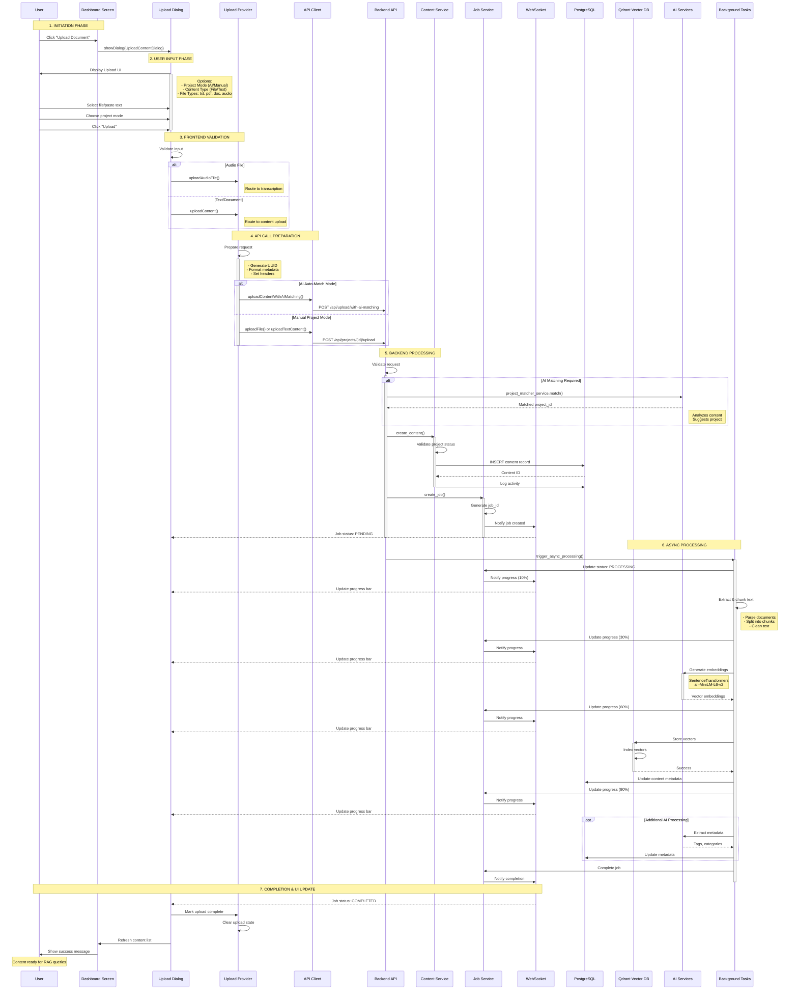
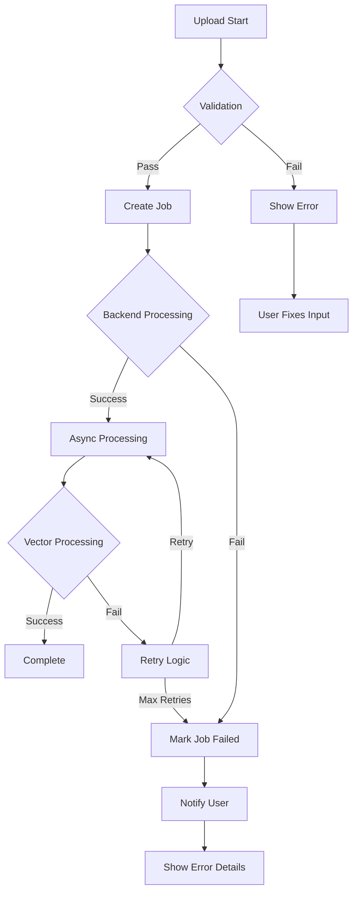

# PM Master V2 - Content Upload Flow Diagram

## End-to-End Upload Process Flow

## Component Responsibilities

### Frontend Components

| Component | File | Responsibilities |
|-----------|------|-----------------|
| **Dashboard Screen** | `dashboard_screen_v2.dart` | - Display upload buttons - Open upload dialog - Show content list |
| **Upload Dialog** | `upload_content_dialog.dart` | - User input collection - File validation - Progress display - Error handling |
| **Upload Provider** | `upload_provider.dart` | - State management - API orchestration - Progress tracking - Error recovery |
| **API Client** | `api_client.dart` | - HTTP requests - Auth headers - Response parsing |

### Backend Components

| Component | File | Responsibilities |
|-----------|------|-----------------|
| **Upload Router** | `upload.py` | - Request validation - AI matching coordination - Response formatting |
| **Content Router** | `content.py` | - Project-specific uploads - File validation - Job creation |
| **Content Service** | `content_service.py` | - Business logic - Database operations - Activity logging |
| **Job Service** | `upload_job_service.py` | - Job lifecycle - Progress tracking - WebSocket notifications |
| **Background Tasks** | Various | - Text processing - Embedding generation - Vector storage |

## Data Flow Summary

### Upload Types
1. **Text Upload**: Direct text → Content Service → Vector DB
2. **File Upload**: File → Parse → Content Service → Vector DB
3. **Audio Upload**: Audio → Transcription → Content Service → Vector DB

### Processing Stages
1. **Validation** (Sync): File type, size, format checks
2. **Storage** (Sync): Database record creation
3. **Processing** (Async): Chunking, embedding, indexing
4. **Notification** (Real-time): WebSocket progress updates

### AI Integration Points
- **Project Matching**: Analyzes content to suggest/create projects
- **Content Classification**: Determines content type (meeting/email)
- **Metadata Extraction**: Extracts tags, topics, entities
- **Embedding Generation**: Creates semantic vectors for search

## Error Handling Flow

## Performance Characteristics

- **Sync Operations**: ~200-500ms (validation + DB insert)
- **Async Processing**: 2-10s depending on content size
- **Embedding Generation**: ~100-500ms per chunk
- **Vector Storage**: ~50-100ms per batch
- **Total End-to-End**: 3-15s for typical documents

## WebSocket Events

| Event | Payload | Description |
|-------|---------|-------------|
| `job.created` | `{job_id, status: "pending"}` | New upload job created |
| `job.processing` | `{job_id, progress: 0-100}` | Processing progress update |
| `job.completed` | `{job_id, content_id}` | Upload completed successfully |
| `job.failed` | `{job_id, error}` | Upload failed with error |
| `content.ready` | `{content_id, project_id}` | Content indexed and searchable |